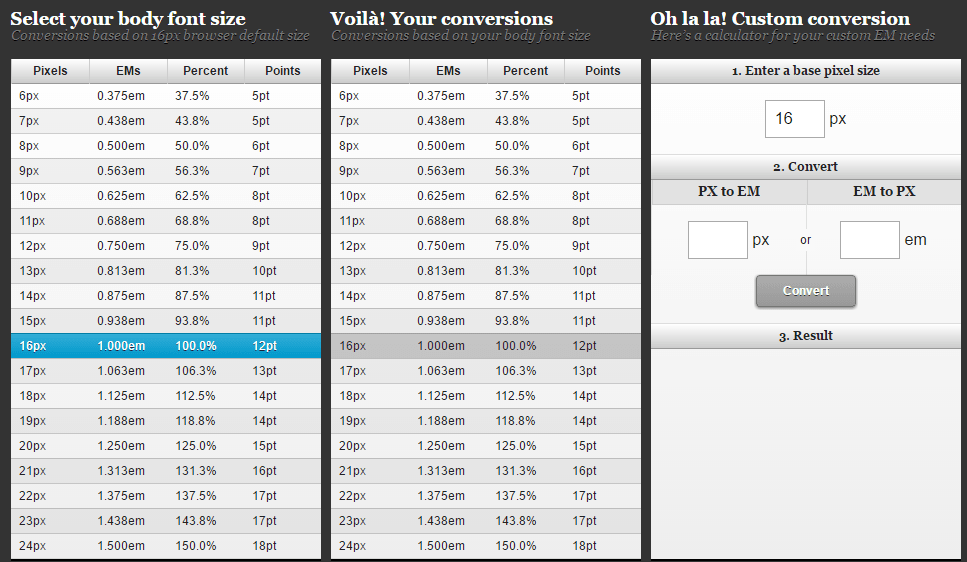

**css单位px，rem，em，vw，vh的区别**

#### px

px就是pixel像素的缩写，相对长度单位，网页设计常用的基本单位。像素px是相对于显示器屏幕分辨率而言的

#### em

em是相对长度单位。相对于当前对象内文本的字体尺寸（参考物是父元素的font-size）

如当前父元素的字体尺寸未设置，则相对于浏览器的默认字体尺寸

特点：

		1. em的值并不是固定的；
  		2. em会继承父级元素的字体大小;

#### rem

rem是CSS3新增的一个相对单位，rem是相对于HTML根元素的字体大小（font-size）来计算的长度单位

如果你没有设置html的字体大小，就会以浏览器默认字体大小，一般是16px

```
html{font-size: 62.5%}  /* 10 ÷ 16 × 100% = 62.5% */

body{font-size: 1.4rem;} /* 1.4 × 10px = 14px */

/*在根元素中定义了一个基本字体大小为62.5%（也就是10px。设置这个值主要方便计算，如果没有设置，将是以“16px”为基准 ）*/
```

优点是，只需要设置根目录的大小就可以把整个页面的成比例的调好

rem兼容性：除了IE8及更早版本外，所有浏览器均已支持rem

em与rem的区别：

​		rem是相对于根元素（html）的字体大小，而em是相对于其父元素的字体大小

两者使用规则：

- 如果这个属性根据它的font-size进行测量，则使用em
- 其他的一切事物属性均使用rem

这里提供了一个px、em、rem单位的转换工具：http://pxtoem.com/

​		

#### vw、vh

vw、vh、vmax、vmin这四个单位都是基于视口

vw是相对视口（viewport）的宽度而定的，长度等于视口宽度的`1/100`

假如浏览器的宽度为200px，那么1vw就等于2px（200px/100）

vh是相对视口（viewport）的高度而定的，长度等于视口高度的`1/100`

假如浏览器的高度为500px，那么1vh就等于5px（500px/100）

vmin和`vmax`是相对于视口的高度和宽度两者之间的`最小值`或`最大值`

```
/*
如果浏览器的高为300px、宽为500px，那么1vmin就是3px，1vmax就是5px；如果浏览器的高为800px，宽为1080px，那么1vmin也是8px，1vmax也是10.8px
*/
```

其他单位：

##### %（百分比）

一般来说就是相对于父元素

1、对于普通定位元素就是我们理解的父元素

2、对于position: absolute;的元素是相对于已定位的父元素

3、对于position: fixed;的元素是相对于ViewPort（可视窗口）

##### vm

css3新单位，相对于视口的宽度或高度中较小的那个

其中最小的那个被均分为100单位的vm

比如：浏览器高度900px，宽度1200px，取最小的浏览器高度，1 vm = 900px/100 = 9 px

缺点：兼容性差

------

常见问题：

1、假如使用em来设置文字大小要注意什么？

注意父元素的字体大小，因为em是根据父元素的大小来设置的。

比如同样是1.5em，要是父元素是20，那1.5em就是30px.要是父元素是30px,1.5em就是45px（特别是在多重div嵌套里面更要注意）

2、pc pt ch一般用在什么场景？

这些我们网页设计基本上用不到，在排版上会有用处

3、如何使 1rem=10px

在设置HTML{font-size：62.5%；}即可

4、如果父元素没有指定高度，那么子元素的百分比的高度是多少？

会按照子元素的实际高度，设置百分比则没有效果

原文链接：[https://www.cnblogs.com/theblogs/p/10516098.html](https://www.cnblogs.com/theblogs/p/10516098.html)

