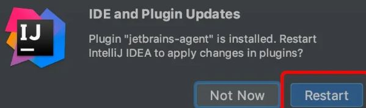

### 激活插件

1、首先下载破解插件：链接: https://pan.baidu.com/s/1cDQxLPJZlWWt5CBu6pDD6A 提取码: 52h3

2、如果网盘下载失败 请在 assets 文件夹中下载 jetbrains-agent2020.1.3.jar 安装包。

3、启动程序，如果是新装用户，注册的时候选择免费试用的（选择Evaluate for free -->点击Evalute按钮）方式进入程序即可，开始第三步；

4、进入程序或者工作界面，将下载好的【压缩包】拖入程序或者程序工作界面，按照里面系统提示操作即可完成破解（Restart-按照-restart）

在部分设备中，如果拖进去几次没提示重启，那就手动重启试下

原文链接：[http://www.winwin7.com/JC/21826.html](http://www.winwin7.com/JC/21826.html)