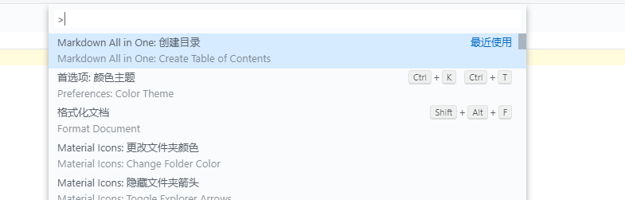

## 解决Github上md文件[toc]无法创建目录的问题

熟悉markdown都知道可以使用`[TOC]`来自动生成markdown文件的标题目录，但是github却不支持`[TOC]`标签

因此这里介绍一种插件方法一键生成目录

这里是针对vscode，安装了Markdown All in One这个插件


然后对于你要生成目录的md文件，vscode快捷键 ctrl + shift + p 打开如下



然后输入 

```
Markdown All in One: Create Table of Contents
```

回车即可生成目录，是不是很方便呢 

上传至GitHub上也亲测有效

#### 总结步骤：

```
安装vscode插件 Markdown All in One
```

```
快捷键 ctrl + shift + p 打开后输入`Markdown All in One: Create Table of Contents`
```

```
over(●'◡'●)
```

原文链接：[https://www.cnblogs.com/muzidaitou/articles/12858842.html](https://www.cnblogs.com/muzidaitou/articles/12858842.html)

