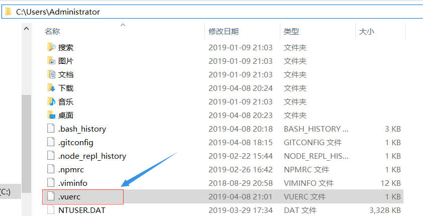
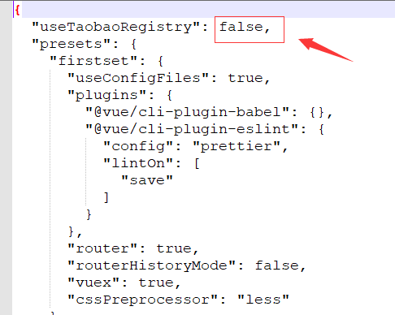

**@vue-cli3创建项目报错：ERROR command failed: npm install --loglevel error --registry=https://registry.npm.taobao.org --di](https://www.cnblogs.com/bobo1/p/10673571.html**

使用@vue-cli3时

在你感觉所以配置都搞好开始创建项目时，不停的报错，就是创建不成功

清npm缓存也不行

改淘宝镜像也不行

就快奔溃了，最后最终（其实我在凑150字，为了能发到首页给更多采坑的兄dei们看到，哈哈哈）

我搜了很多最终用下面这个方法解决了

1. 打开这个文件

2. 这个值开始是true，改成false再重新创建项目就ok了

   