---

---

#### IIS上部署Vue网站 由于history模式导致刷新页面出现404报错的解决方式

在IIS上部署Vue网站，网页点击刷新按钮后出现如下图所示的错误；

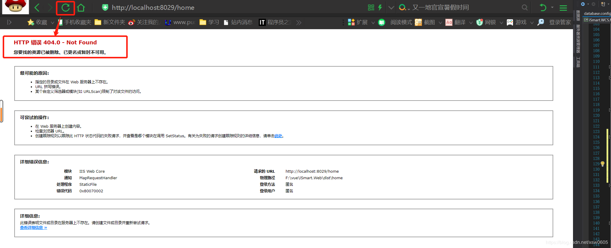

原因主要是配置文件中Router配置了history模式

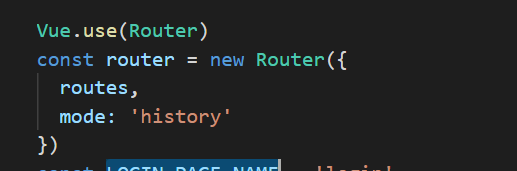

解决方式，为IIS安装Url重写工具，并进行相应的配置，安装方式以及配置操作如下；

1、下载Web平台安装程序，这里最后使用的是5.1的版本，下载可以到百度搜索一下，3.0的版本测试的时候无法打开

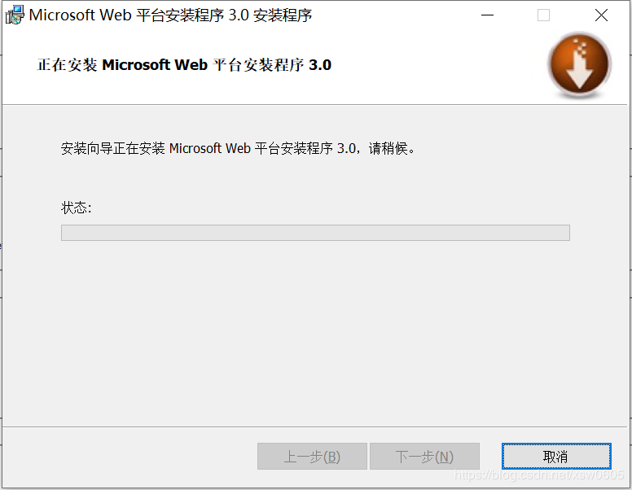

安装完成后在IIS可看到如下图标

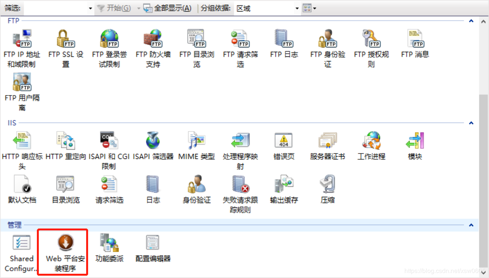

打开后如下图所示

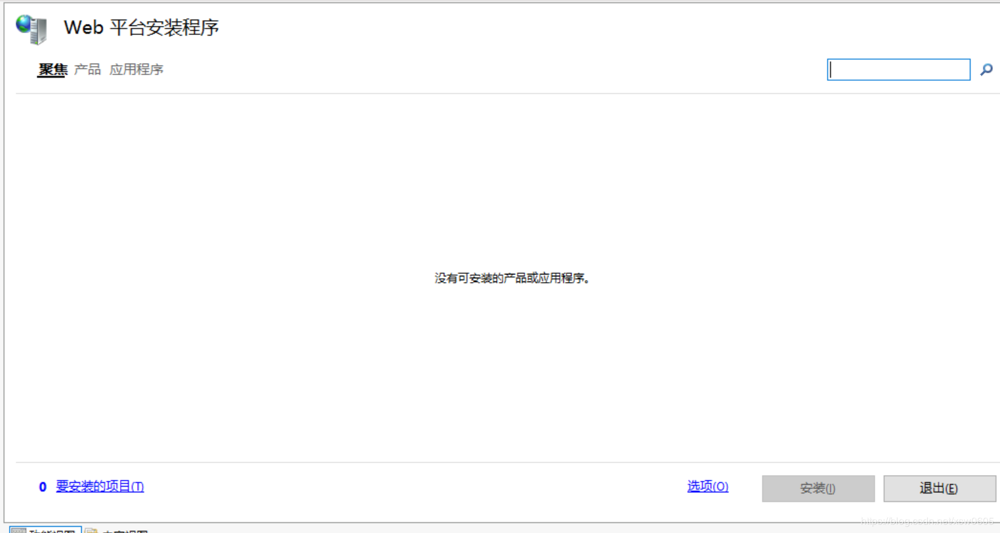

通过搜索工具搜索Url工具（记住安装需要管理员权限，可以在开始菜单直接管理员权限打开Web平台程序进行操作）

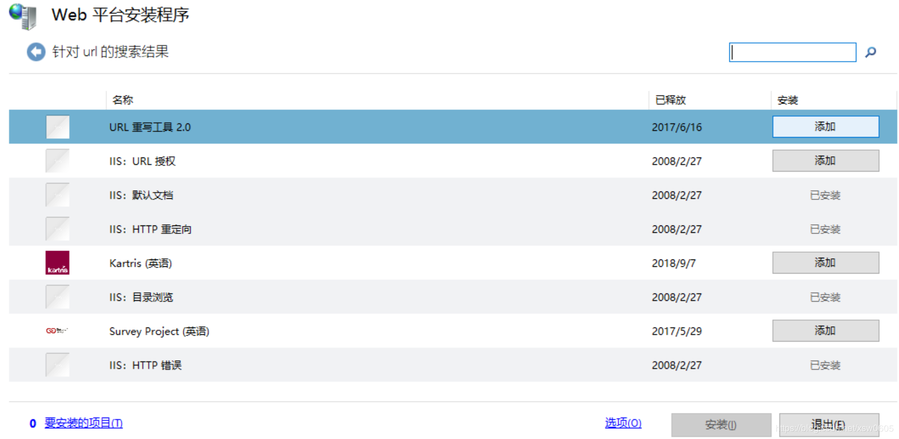

安装完成后，IIS可看到如下图标

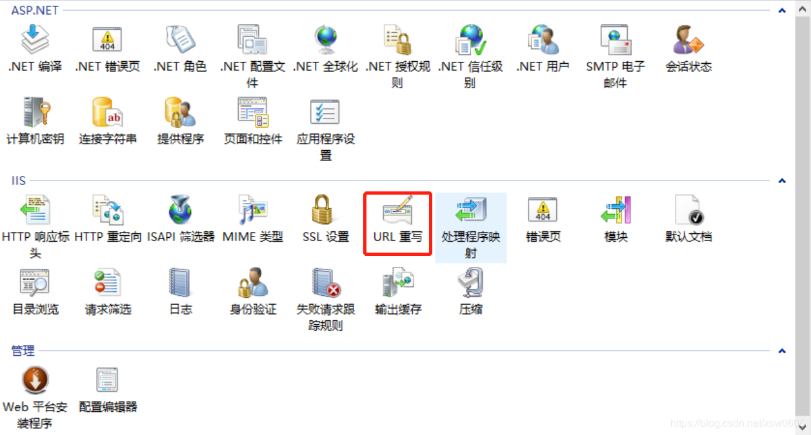

双击后按如下进行配置

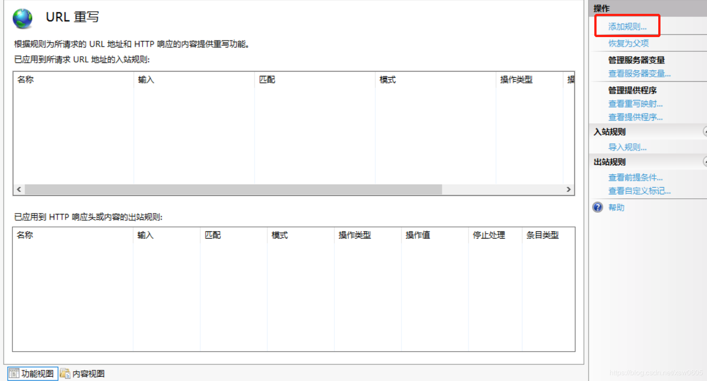

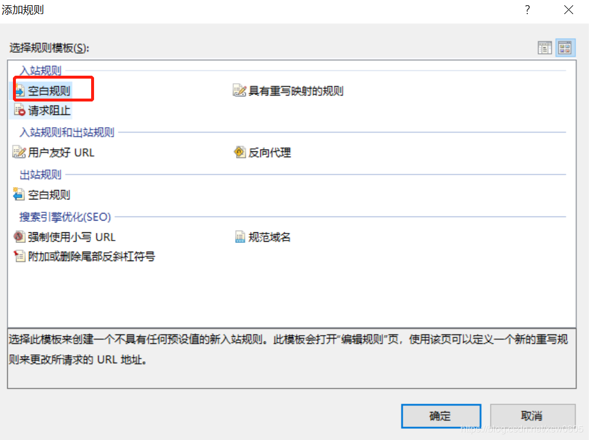

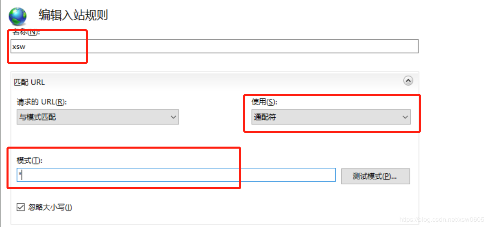

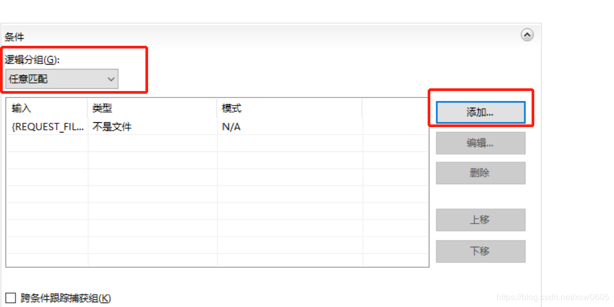

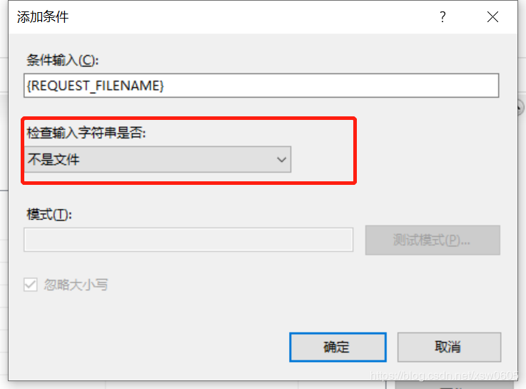

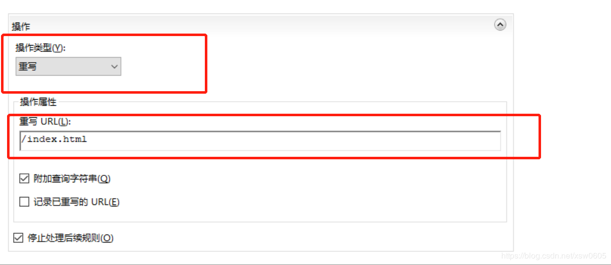

最后将修改的配置应用，配置完成

原文链接：[https://blog.csdn.net/xsw0605/article/details/105560582](https://blog.csdn.net/xsw0605/article/details/105560582 )